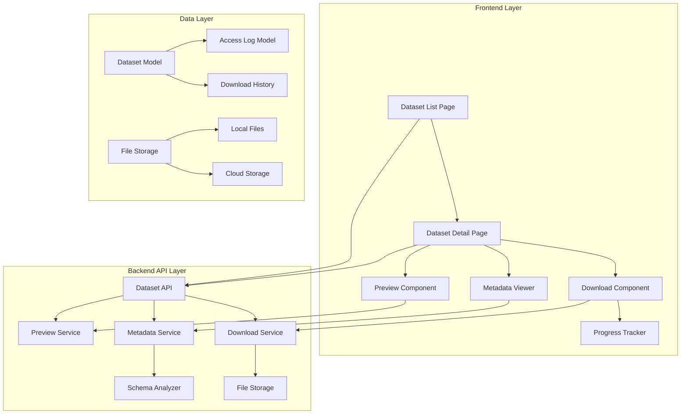

# Design Document

## Overview

The Enhanced Dataset Management System builds upon the existing dataset functionality to provide comprehensive download capabilities, detailed data structure documentation, and improved user experience. The system maintains the current architecture while adding new components for file serving, metadata visualization, and enhanced permission management.

The design leverages the existing FastAPI backend with SQLAlchemy models and React/Next.js frontend, extending them with new endpoints, UI components, and data processing capabilities.

## Architecture

### System Components



### Current System Integration

The enhanced system integrates with existing components:

- **Authentication**: Uses existing `get_current_user` dependency
- **Authorization**: Leverages `DataSharingService` for access control
- **Database**: Extends existing SQLAlchemy models
- **File Handling**: Builds on current upload infrastructure
- **Organization Management**: Respects existing multi-tenant architecture

## Components and Interfaces

### Backend Components

#### 1. Enhanced Dataset API Endpoints

**Existing Endpoints (Enhanced)**:
- `GET /datasets/{id}/download` - Currently returns metadata, will return actual file
- `GET /datasets/{id}/stats` - Enhanced with download statistics
- `GET /datasets/{id}` - Enhanced with metadata and preview data

**New Endpoints**:
- `GET /datasets/{id}/preview` - Dataset content preview
- `GET /datasets/{id}/metadata` - Detailed schema and statistics
- `GET /datasets/{id}/download-history` - Download tracking for owners
- `POST /datasets/{id}/download-token` - Generate secure download tokens

#### 2. Download Service

```python
class DownloadService:
    def __init__(self, db: Session, storage_service: StorageService):
        self.db = db
        self.storage = storage_service
    
    async def download_dataset(
        self, 
        dataset_id: int, 
        user: User, 
        format: Optional[str] = None
    ) -> StreamingResponse:
        """Stream dataset file with permission checks and logging"""
        
    async def get_download_progress(self, download_id: str) -> Dict:
        """Get download progress for large files"""
        
    async def generate_download_token(
        self, 
        dataset_id: int, 
        user: User, 
        expires_in: int = 3600
    ) -> str:
        """Generate secure download token"""
```

#### 3. Metadata Service

```python
class MetadataService:
    def __init__(self, db: Session):
        self.db = db
    
    async def analyze_dataset_schema(self, dataset: Dataset) -> Dict:
        """Analyze and return detailed schema information"""
        
    async def get_data_quality_metrics(self, dataset: Dataset) -> Dict:
        """Calculate data quality scores and statistics"""
        
    async def generate_preview_data(
        self, 
        dataset: Dataset, 
        rows: int = 20
    ) -> Dict:
        """Generate preview data without loading full file"""
```

#### 4. Enhanced Models

**Dataset Model Extensions**:
```python
class Dataset(Base):
    # Existing fields...
    
    # New fields for enhanced functionality
    file_path = Column(String, nullable=True)  # Actual file storage path
    preview_data = Column(JSON, nullable=True)  # Cached preview data
    schema_metadata = Column(JSON, nullable=True)  # Detailed schema info
    download_count = Column(Integer, default=0)  # Download statistics
    last_downloaded_at = Column(DateTime, nullable=True)
    
    # Data quality metrics
    quality_metrics = Column(JSON, nullable=True)
    completeness_stats = Column(JSON, nullable=True)
    column_statistics = Column(JSON, nullable=True)
```

**New Models**:
```python
class DatasetDownload(Base):
    __tablename__ = "dataset_downloads"
    
    id = Column(Integer, primary_key=True)
    dataset_id = Column(Integer, ForeignKey("datasets.id"))
    user_id = Column(Integer, ForeignKey("users.id"))
    download_token = Column(String, unique=True)
    file_format = Column(String)  # csv, json, excel
    file_size = Column(Integer)
    download_status = Column(String)  # pending, in_progress, completed, failed
    started_at = Column(DateTime, default=datetime.utcnow)
    completed_at = Column(DateTime, nullable=True)
    error_message = Column(Text, nullable=True)
    ip_address = Column(String, nullable=True)
    user_agent = Column(String, nullable=True)
```

### Frontend Components

#### 1. Enhanced Dataset Detail Page

**New Sections**:
- **Metadata Panel**: Displays schema, statistics, and data quality metrics
- **Preview Section**: Shows first 20 rows with column information
- **Download Section**: Multiple format options with progress tracking
- **Usage Analytics**: Download history and access statistics (for owners)

#### 2. Download Component

```typescript
interface DownloadComponentProps {
  dataset: Dataset;
  onDownloadStart: (downloadId: string) => void;
  onDownloadComplete: () => void;
}

const DownloadComponent: React.FC<DownloadComponentProps> = ({
  dataset,
  onDownloadStart,
  onDownloadComplete
}) => {
  // Download format selection
  // Progress tracking
  // Error handling
  // Resume capability
};
```

#### 3. Metadata Viewer Component

```typescript
interface MetadataViewerProps {
  dataset: Dataset;
  metadata: DatasetMetadata;
}

const MetadataViewer: React.FC<MetadataViewerProps> = ({
  dataset,
  metadata
}) => {
  // Schema visualization
  // Data type information
  // Statistics display
  // Quality metrics
};
```

#### 4. Preview Component

```typescript
interface PreviewComponentProps {
  dataset: Dataset;
  previewData: PreviewData;
  maxRows?: number;
}

const PreviewComponent: React.FC<PreviewComponentProps> = ({
  dataset,
  previewData,
  maxRows = 20
}) => {
  // Tabular data display
  // Column type indicators
  // Pagination for large previews
  // Export preview functionality
};
```

## Data Models

### Enhanced Dataset Schema

```json
{
  "dataset": {
    "id": 123,
    "name": "Sales Data Q4 2024",
    "description": "Quarterly sales performance data",
    "type": "csv",
    "status": "active",
    "file_path": "/storage/datasets/123/sales_q4_2024.csv",
    "size_bytes": 2048576,
    "row_count": 15000,
    "column_count": 12,
    "download_count": 5,
    "last_downloaded_at": "2024-01-15T10:30:00Z",
    "schema_metadata": {
      "columns": [
        {
          "name": "date",
          "type": "datetime",
          "nullable": false,
          "unique_values": 92,
          "null_count": 0,
          "sample_values": ["2024-01-01", "2024-01-02", "2024-01-03"]
        },
        {
          "name": "sales_amount",
          "type": "float",
          "nullable": true,
          "min_value": 0.0,
          "max_value": 50000.0,
          "mean": 1250.75,
          "null_count": 12,
          "sample_values": [1200.50, 2300.00, 875.25]
        }
      ],
      "primary_key": ["id"],
      "foreign_keys": [],
      "indexes": ["date", "customer_id"]
    },
    "quality_metrics": {
      "overall_score": 0.92,
      "completeness": 0.95,
      "consistency": 0.89,
      "accuracy": 0.94,
      "issues": [
        {
          "type": "missing_values",
          "column": "sales_amount",
          "count": 12,
          "percentage": 0.08
        }
      ]
    },
    "preview_data": {
      "headers": ["id", "date", "customer_id", "sales_amount"],
      "rows": [
        [1, "2024-01-01", "CUST001", 1200.50],
        [2, "2024-01-01", "CUST002", 2300.00]
      ],
      "total_rows": 15000,
      "is_sample": true
    }
  }
}
```

### Download History Schema

```json
{
  "download_history": [
    {
      "id": 456,
      "dataset_id": 123,
      "user": {
        "id": 789,
        "email": "analyst@company.com",
        "name": "Data Analyst"
      },
      "download_token": "dl_abc123xyz",
      "file_format": "csv",
      "file_size": 2048576,
      "status": "completed",
      "started_at": "2024-01-15T10:30:00Z",
      "completed_at": "2024-01-15T10:32:15Z",
      "duration_seconds": 135,
      "ip_address": "192.168.1.100",
      "user_agent": "Mozilla/5.0..."
    }
  ]
}
```

## Error Handling

### Backend Error Handling

**Download Errors**:
- File not found: Return 404 with clear message
- Permission denied: Return 403 with specific permission requirements
- File corruption: Return 500 with recovery suggestions
- Network interruption: Support resumable downloads

**Metadata Errors**:
- Schema analysis failure: Return partial metadata with warnings
- Large file timeout: Return cached metadata or sample-based analysis
- Unsupported format: Return basic metadata with format limitations

### Frontend Error Handling

**Download Error States**:
- Network failure: Show retry button with exponential backoff
- Permission error: Display permission requirements and contact info
- File corruption: Suggest alternative formats or contact support
- Quota exceeded: Show quota limits and reset time

**User Feedback**:
- Progress indicators for long operations
- Clear error messages with actionable steps
- Success confirmations with next steps
- Loading states for all async operations

## Testing Strategy

### Backend Testing

**Unit Tests**:
- Download service functionality
- Metadata analysis accuracy
- Permission validation
- File streaming performance

**Integration Tests**:
- End-to-end download workflows
- Database transaction integrity
- File storage operations
- API endpoint responses

**Performance Tests**:
- Large file download streaming
- Concurrent download handling
- Metadata analysis speed
- Database query optimization

### Frontend Testing

**Component Tests**:
- Download component interactions
- Metadata display accuracy
- Preview data rendering
- Error state handling

**E2E Tests**:
- Complete download workflows
- Permission-based access control
- Multi-format download scenarios
- Progress tracking accuracy

**Accessibility Tests**:
- Screen reader compatibility
- Keyboard navigation
- Color contrast compliance
- ARIA label accuracy

### Test Data Requirements

**Sample Datasets**:
- Small CSV (< 1MB) for quick tests
- Large CSV (> 100MB) for performance tests
- JSON with nested structures
- Excel with multiple sheets
- Corrupted files for error testing
- Files with various character encodings

**User Scenarios**:
- Dataset owner with full permissions
- Organization member with view access
- Department member with limited access
- External user with shared access
- Anonymous user (should be denied)

## Security Considerations

### Download Security

**Access Control**:
- Validate user permissions before file access
- Generate time-limited download tokens
- Log all download attempts for audit
- Rate limiting to prevent abuse

**File Security**:
- Virus scanning for uploaded files
- Secure file storage with encryption
- Temporary download URLs that expire
- No direct file system access from web

### Data Privacy

**Sensitive Data Handling**:
- Mask PII in preview data
- Audit trail for all data access
- Compliance with data retention policies
- Secure deletion of temporary files

**Organization Boundaries**:
- Strict organization-level isolation
- No cross-organization data access
- Encrypted data transmission
- Secure session management

## Performance Optimization

### File Serving

**Streaming Downloads**:
- Chunked transfer encoding for large files
- Resume capability for interrupted downloads
- CDN integration for global distribution
- Compression for text-based formats

**Caching Strategy**:
- Cache metadata analysis results
- Cache preview data for quick access
- Redis for download token storage
- Browser caching for static assets

### Database Optimization

**Query Performance**:
- Indexes on frequently queried columns
- Pagination for large result sets
- Connection pooling for concurrent access
- Query optimization for complex joins

**Storage Efficiency**:
- JSON compression for metadata
- Archival of old download logs
- Cleanup of expired download tokens
- Efficient file storage organization