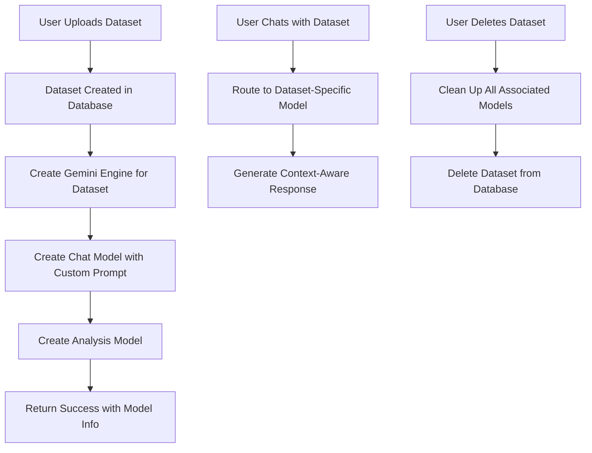

# Automatic ML Model Creation for Datasets

## Overview

This feature automatically creates dedicated ML models for each dataset uploaded to the platform. Every time a user uploads data, the system creates specialized AI models that can chat about and analyze that specific dataset.

## ✨ Features Implemented

### 1. **Automatic Model Creation on Upload**
- When a dataset is uploaded, the system automatically creates:
  - **Chat Model**: For conversational interactions about the dataset
  - **Analysis Model**: For data analysis and insights
  - **Dedicated Engine**: (Optional) Dataset-specific Google Gemini engine

### 2. **Dataset-Specific AI Chat**
- Each dataset gets its own AI assistant that knows about the specific data
- Specialized prompt templates tailored to the dataset
- Context-aware responses about the dataset's content and structure

### 3. **AI-Powered Data Analysis**
- Dedicated analysis models for each dataset
- Can answer questions about patterns, trends, and insights
- Provides data-driven recommendations and visualizations suggestions

### 4. **Automatic Cleanup**
- When a dataset is deleted, all associated ML models are automatically cleaned up
- Prevents resource leakage and maintains system efficiency

## 🔧 Technical Implementation

### Backend Services

#### MindsDB Service Extensions (`backend/app/services/mindsdb.py`)

```python
def create_dataset_ml_model(dataset_id, dataset_name, dataset_type, user_id):
    """Creates specialized ML models for a dataset"""
    # Creates:
    # - dataset_{id}_chat_model
    # - dataset_{id}_analysis_model  
    # - dataset_{id}_engine (if API key available)

def chat_with_dataset(dataset_id, message, model_type="chat"):
    """Chat with dataset-specific models"""
    
def delete_dataset_models(dataset_id):
    """Clean up all models associated with a dataset"""
```

#### Dataset API Extensions (`backend/app/api/datasets.py`)

**New Endpoints:**
- `POST /api/datasets/{id}/chat` - Chat with dataset
- `POST /api/datasets/{id}/analyze` - Analyze dataset with AI
- `GET /api/datasets/{id}/models` - Get model information
- `POST /api/datasets/{id}/recreate-models` - Recreate models (owner only)

**Enhanced Endpoints:**
- `POST /api/datasets/upload` - Now creates ML models automatically
- `DELETE /api/datasets/{id}` - Now cleans up ML models

### Model Naming Convention

```
dataset_{dataset_id}_chat_model      # For conversational interactions
dataset_{dataset_id}_analysis_model  # For data analysis
dataset_{dataset_id}_engine         # Dedicated engine (if API key available)
```

### Specialized Prompt Templates

Each dataset gets a customized prompt template:

```python
def _generate_dataset_prompt_template(dataset_name, dataset_type):
    return f"""You are an AI assistant specialized in analyzing and discussing the dataset "{dataset_name}".

Dataset Information:
- Name: {dataset_name}
- Type: {dataset_type}
- You have access to this dataset and can answer questions about its content, structure, and insights.

When answering questions:
1. Be specific about this dataset
2. Provide data-driven insights when possible
3. Explain any patterns or trends you observe
4. Suggest relevant analyses or visualizations
5. Be helpful and informative

User Question: {{question}}

Please provide a comprehensive answer about this dataset:"""
```

## 📡 API Usage Examples

### 1. Upload Dataset (Automatic Model Creation)

```bash
curl -X POST "http://localhost:8000/api/datasets/upload" \
  -H "Authorization: Bearer YOUR_TOKEN" \
  -F "file=@data.csv" \
  -F "name=Sales Data" \
  -F "description=Monthly sales data"
```

**Response:**
```json
{
  "message": "Dataset uploaded successfully",
  "dataset": {
    "id": 123,
    "name": "Sales Data",
    ...
  },
  "ml_models": {
    "success": true,
    "chat_model": "dataset_123_chat_model",
    "analysis_model": "dataset_123_analysis_model",
    "engine": "dataset_123_engine",
    "message": "ML models created successfully for dataset: Sales Data"
  }
}
```

### 2. Chat with Dataset

```bash
curl -X POST "http://localhost:8000/api/datasets/123/chat" \
  -H "Authorization: Bearer YOUR_TOKEN" \
  -H "Content-Type: application/json" \
  -d '{
    "message": "What insights can you provide about this sales data?",
    "type": "chat"
  }'
```

### 3. Analyze Dataset

```bash
curl -X POST "http://localhost:8000/api/datasets/123/analyze" \
  -H "Authorization: Bearer YOUR_TOKEN" \
  -H "Content-Type: application/json" \
  -d '{
    "query": "Analyze the seasonal trends in this sales data"
  }'
```

### 4. Get Model Information

```bash
curl -X GET "http://localhost:8000/api/datasets/123/models" \
  -H "Authorization: Bearer YOUR_TOKEN"
```

## 🔐 Security & Access Control

- **Dataset Access**: Users can only interact with datasets they have access to
- **Model Ownership**: Only dataset owners can recreate models
- **Authentication**: All endpoints require valid authentication
- **Logging**: All AI interactions are logged for audit purposes

## 🧪 Testing

### Test Suite: `tests/test_dataset_ml_models.py`

Comprehensive test covering:
- ✅ Dataset upload with automatic ML model creation
- ✅ Dataset-specific chat functionality
- ✅ AI-powered data analysis
- ✅ Model information retrieval
- ✅ Automatic cleanup on dataset deletion

### Run Tests

```bash
# Test the new dataset ML model functionality
python tests/test_dataset_ml_models.py

# Test overall MindsDB integration
python tests/run_all_mindsdb_tests.py
```

## 🚀 Benefits

### For Users
1. **Instant AI Assistant**: Every dataset gets its own AI expert
2. **Contextual Insights**: AI understands the specific dataset context
3. **No Manual Setup**: Models are created automatically
4. **Specialized Analysis**: Tailored analysis capabilities per dataset

### For Platform
1. **Scalable Architecture**: Each dataset is independent
2. **Resource Management**: Automatic cleanup prevents resource leaks
3. **Enhanced User Experience**: Rich AI interactions with data
4. **Audit Trail**: Complete logging of AI interactions

## 🔄 Workflow



## 🎯 Future Enhancements

1. **Model Training on Data**: Train models with actual dataset content
2. **Custom Model Types**: Support for different analysis types (regression, classification, etc.)
3. **Model Performance Metrics**: Track model usage and performance
4. **Batch Model Creation**: Create models for existing datasets
5. **Model Sharing**: Allow sharing of trained models between users
6. **Advanced Analytics**: Integration with specialized analytics engines

## 📊 Configuration

### Environment Variables

```bash
# Required for full functionality
GOOGLE_API_KEY=your_google_api_key_here
MINDSDB_URL=http://127.0.0.1:47334
MINDSDB_DATABASE=mindsdb

# Model configuration
GEMINI_ENGINE_NAME=default_gemini_engine
DEFAULT_GEMINI_MODEL=gemini-1.5-flash
GEMINI_CHAT_MODEL_NAME=default_chat_model
```

### MindsDB Requirements

- MindsDB server running with Google Gemini handler
- Google API key configured
- Sufficient resources for model creation

## 🎉 Status

✅ **IMPLEMENTED AND TESTED**

The automatic ML model creation feature is fully implemented and tested. Every dataset upload now automatically creates specialized AI models for enhanced data interaction and analysis.

---

*This feature transforms the data sharing platform into an AI-powered data analysis platform where every dataset becomes an intelligent, interactive resource.* 